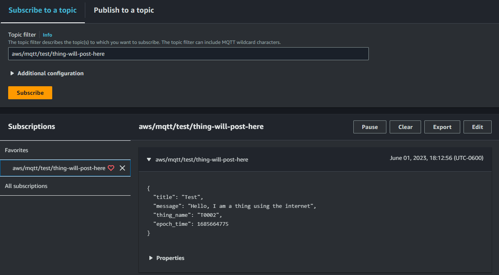
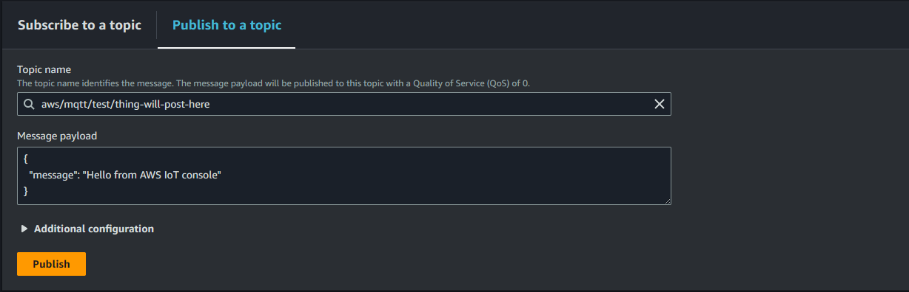
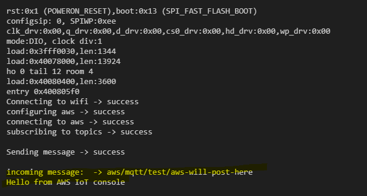

# AWS MQTT Basic example

This repository provides an example of how to implement AWS MQTT functionality.
<br><br>

## **Installation**

The following steps guide you through the setup process.

### **Install Libraries for ESP32 boards**

1. Open Arduino IDE.
2. Go to **File** -> **Preferences**.
3. In the preferences window, go to the **Additional boards manager URLs** field.
4. Add the following URL: `https://raw.githubusercontent.com/espressif/arduino-esp32/gh-pages/package_esp32_index.json`.
5. Close the preferences window.
6. Go to **Tools** -> **Board** -> **Boards Manager**.
7. Search for "ESP32" in the Boards Manager.
8. Install the ESP32 by Espressif.

### **Select Board**

1. Go to **Tools** -> **Board** -> **ESP32**.
2. Select the **uPesy ESP32 Wroom DevKit** board type.

### **Install required libraries**

you must install the following libraries
`WiFiClientSecure.h`, `PubSubClient.h` `ArduinoJson.h`

1. Go to **Tools** -> **Manage Libraries**
2. Write the name of the library in the search field
3. Install it
   <br><br>

## **Configuration**

### **Increase MQTT_MAX_PACKET_SIZE**

If 256 is not enough for your message size you can increase it
To increase the `MQTT_MAX_PACKET_SIZE` value:

1. Open the `PubSubClient` library.
2. Go to line 26.
3. Replace the value of `MQTT_MAX_PACKET_SIZE` from `206` to `512`.

```cpp
// Before
#define MQTT_MAX_PACKET_SIZE 206
```

```cpp
// After
#define MQTT_MAX_PACKET_SIZE 206
```

### **Fill the config file**

Open the file src/headers/Config.h and replace all the values.

### **Compile and upload to your device**

<br><br>

## **Test**

once your device is working you can monitor it.

### **Open the Serial monitor**

1. In the Arduino IDE go to **`Tools`** -> **`Serial monitor`**
2. Select the port of your board
3. Set the boud rate to 115200 baud
4. Start monitoring

### **Open the MQTT test client in the AWS Console**

1. In AWS Console go to **`IoTCore`** -> **`Test`** -> **`MQTT test client`**
2. In `topic filter` field write `aws/mqtt/test/thing-will-post-here`
3. Do click on `subscribe` button
4. Start monitoring the messages sended from your device
5. Now go to the tab **`Publish to a topic`**
6. In `topic name` field write `aws/mqtt/test/thing-will-post-here`
7. Do click on `Publish` button
8. Go back to the serial monitor in the Arduino ID
9. Now you can see a message sended from AWS to your device
   <br><br>
   <br>
   <br>
   
